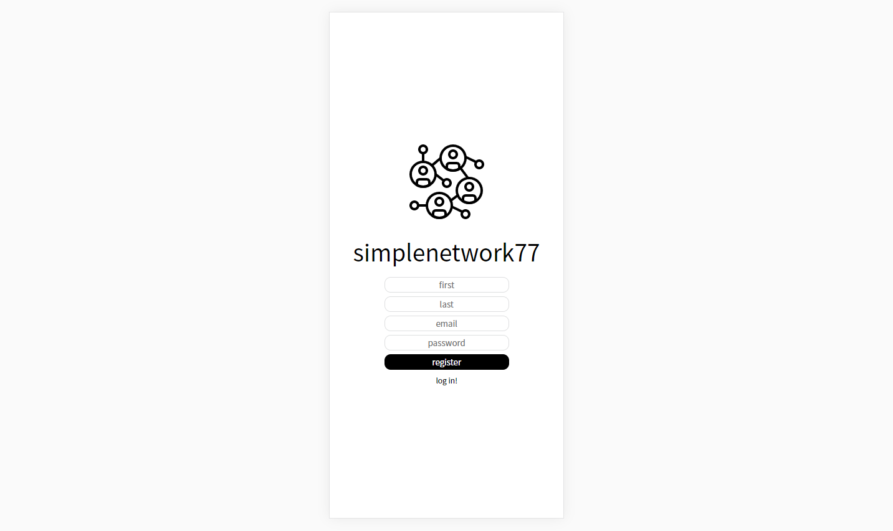
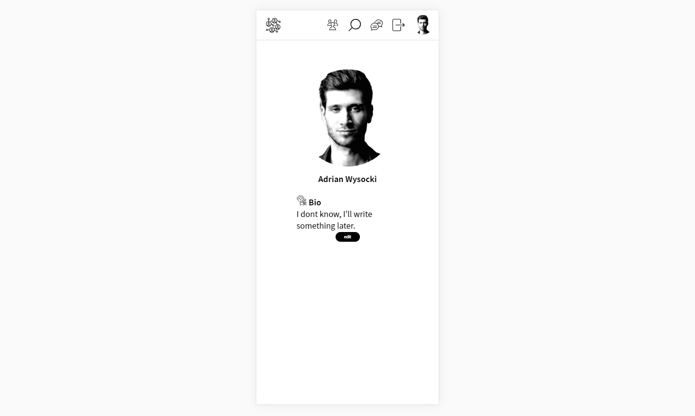
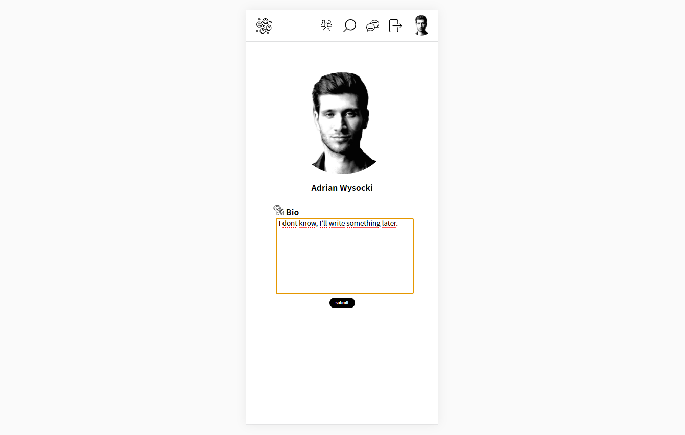
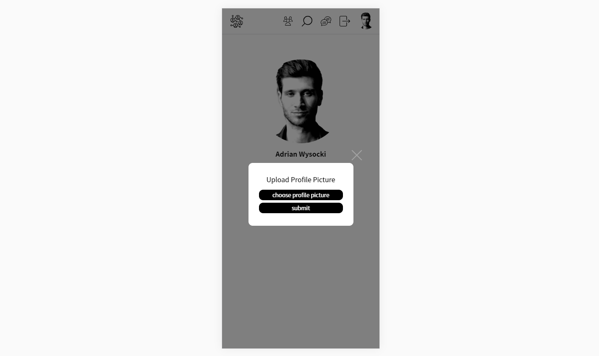
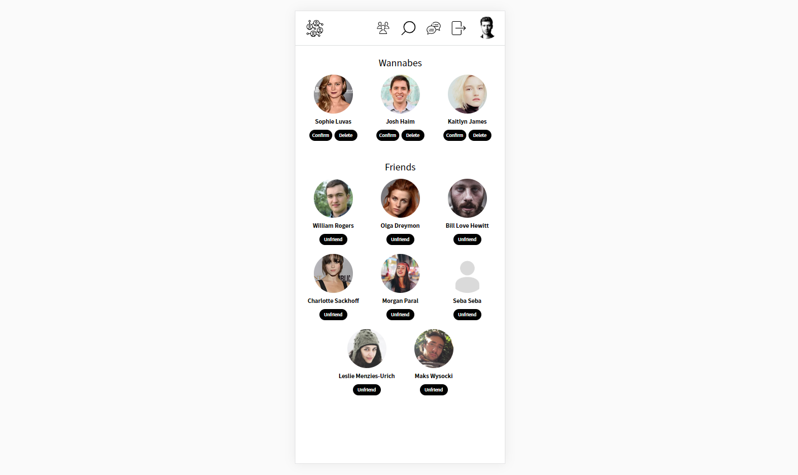
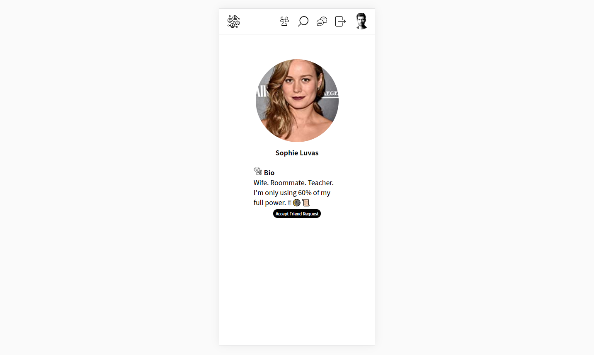
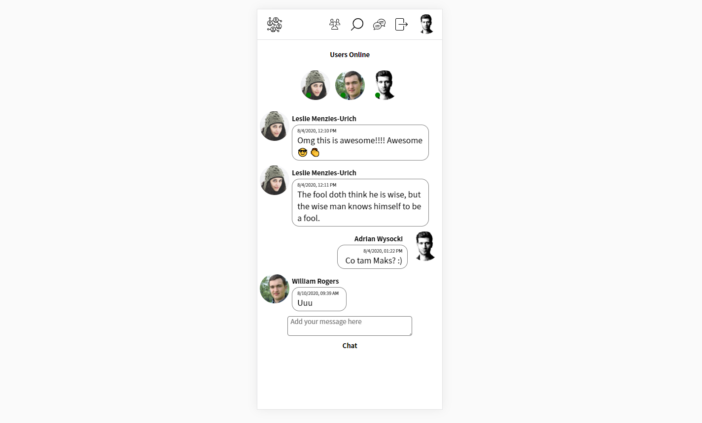
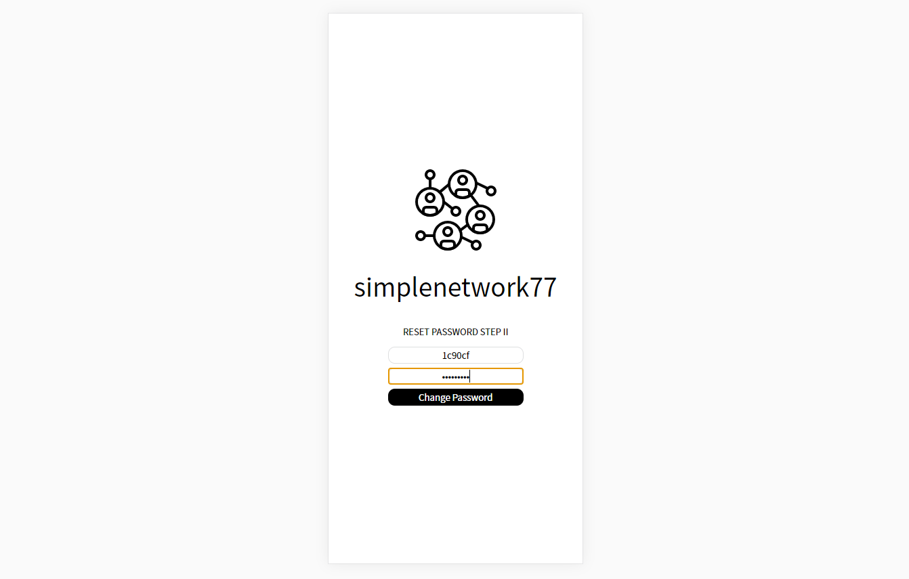

### Socialnetwork

Create account, add profile picture, add friends, search for friends, take part in group chat.

https://simplenetwork77.herokuapp.com/

---

### Frontend

HTML/CSS, React.js

---

### Backend

Node.js, Express.js, PostgreSQL, AWS S3 for storing pictures with reference in database, passwords are salted-hashed and encrypted with Node and Bcrypt, Cookie Session takes care about already logged in user. Page is protected from SQL injections and CSURF attacks, Socket.io protocol for chat feature

---

### Features

Create account

Logged in user profile page

Edit user profile

Upload profile picture

See your friends and your friends invitations

Other user profile, add friend by sending invitation

Take part in a group chat

Search for friends

Reset password with AWS ses

